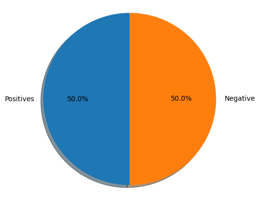
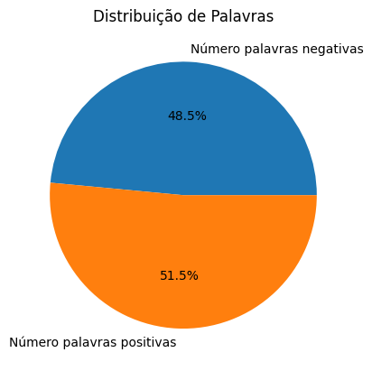
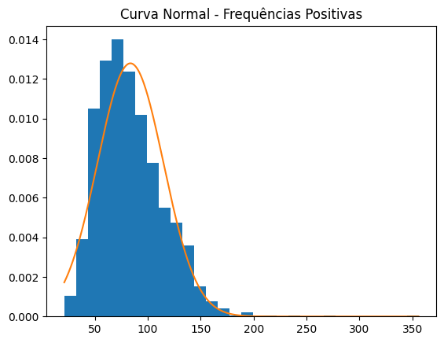
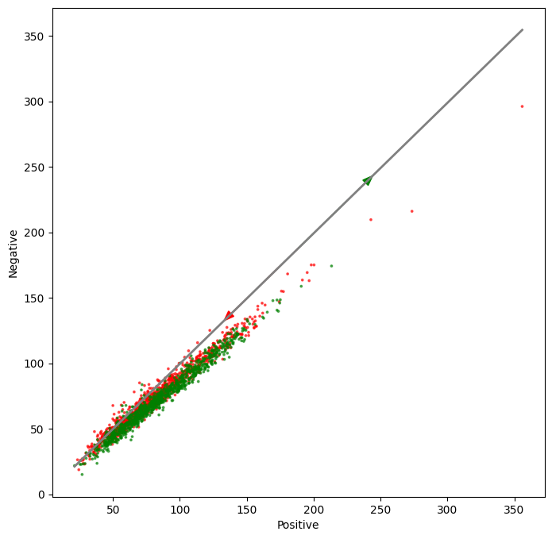
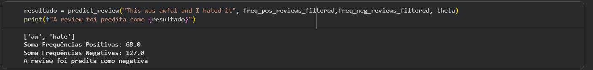

# Análise de Sentimentos de Reviews de Filmes com Regressão Logística

Este projeto apresenta a implementação completa de um modelo de **Regressão Logística** para análise de sentimentos em reviews de filmes, utilizando o dataset `movie_reviews` da biblioteca **NLTK**.

Todo o processo foi desenvolvido do zero, incluindo:

- Pré-processamento textual
- Engenharia de atributos
- Implementação matemática da Regressão Logística
- Treinamento e validação
- Interpretação dos pesos aprendidos

O objetivo é classificar cada review como:

- 0 → Negativa
- 1 → Positiva

---
## Instalação

Clone o repositório:

git clone https://github.com/TarikSalles/movie-review-sentiment-classification

Instale as dependências:

pip install -r requirements.txt

---
## Dataset

Foi utilizado o dataset `movie_reviews` da biblioteca NLTK, contendo:

- 1000 reviews positivas
- 1000 reviews negativas

Cada review é composta por texto bruto, que passa por um pipeline completo de processamento antes de ser utilizado pelo modelo.

---

## Pipeline de Pré-processamento

O pipeline aplicado às reviews inclui:

### Tokenização

Separação do texto em palavras utilizando `word_tokenize`.

---

### Lowercase

Conversão de todas as palavras para minúsculas.

---

### Remoção de Pontuação

Remoção de símbolos e caracteres especiais para evitar ruído na modelagem.

---

### Remoção de Stopwords

Remoção de palavras que não agregam valor semântico relevante para classificação, como:

- artigos  
- preposições  
- pronomes  

Essa etapa reduz dimensionalidade e melhora a qualidade dos atributos.

---

### Stemming

Redução das palavras ao seu radical utilizando `SnowballStemmer`.

Isso permite que variações de uma mesma palavra sejam tratadas como um único conceito.

---

## Engenharia de Atributos

Em vez de utilizar TF-IDF ou embeddings, foi adotada uma abordagem baseada em **frequência de palavras associadas a cada classe**.

Foram construídos dois dicionários:

- Frequências de palavras em reviews positivas
- Frequências de palavras em reviews negativas

Para cada nova review, são calculados:

- `freq_pos` : soma das frequências das palavras associadas à classe positiva  
- `freq_neg` : soma das frequências das palavras associadas à classe negativa  

Cada review é representada pelo vetor:

x = [1, freq_pos, freq_neg]

Onde:

- `1` representa o termo de bias.

---

## Modelo de Regressão Logística

O modelo calcula:

z = θ0 + θ1 * freq_pos + θ2 * freq_neg

E aplica a função sigmoide:

ŷ = 1 / (1 + e^(−z))

A classificação final é feita utilizando limiar 0.5.

---

## Parâmetros Aprendidos

Após o treinamento, os pesos obtidos foram:

θ = [-0.017, 5.040, -5.060]

O modelo final pode ser escrito como:

z = -0.017 + 5.04 * freq_pos - 5.06 * freq_neg

---

## Conclusão e Resultados

- O peso positivo (+5.04) aumenta fortemente a probabilidade da classe positiva.
- O peso negativo (−5.06) reduz fortemente essa probabilidade.
- O bias próximo de zero (−0.017) sugere que o dataset está balanceado.

Como os pesos são praticamente iguais, foi visto que o modelo essencialmente aprende a diferença entre palavras positivas e negativas

Ou seja, a decisão depende principalmente do balanço entre evidências positivas e negativas no texto.

---

## Tecnologias Utilizadas

- Python
- NumPy
- NLTK
- Matplotlib
- Jupyter Notebook

